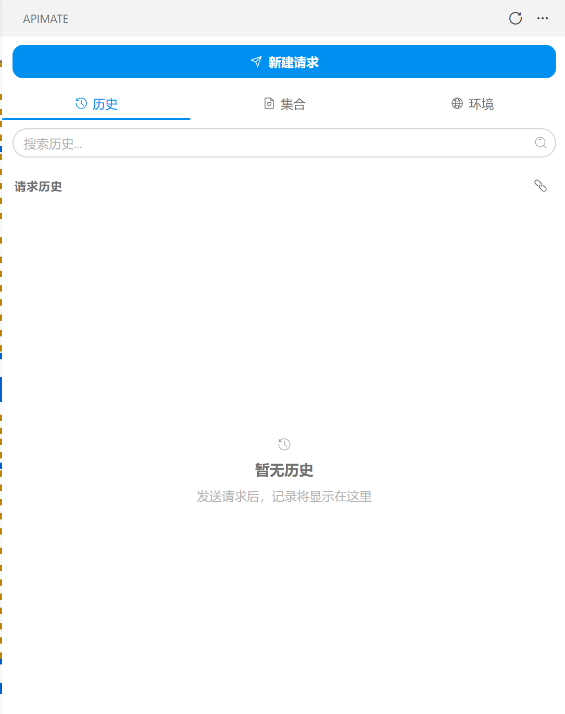
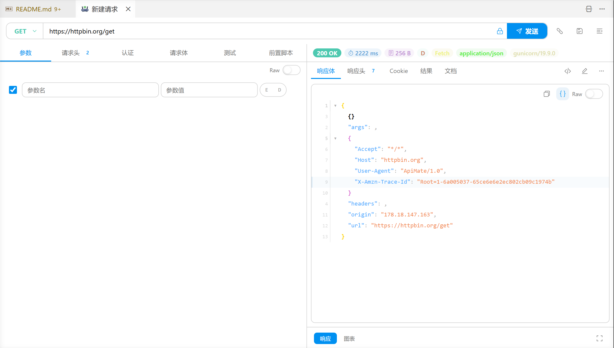

  

<h1 align="center">ApiMate</h1>

  <strong>A full-featured API testing extension for VS Code</strong>

  <a href="#english">English</a> | <a href="#中文">中文</a>

  
  
  

---

## Features

### HTTP Request Editor

 Request Methods &amp; URL

- Support all HTTP methods: GET, POST, PUT, DELETE, PATCH, HEAD, OPTIONS
- URL input with environment variable auto-completion (`{{variable_name}}`)
- Query parameters editor with key-value pairs, auto-add new row on input
- URL auto-encodes special characters

 Request Headers

- Key-value header editor with auto-add new row
- Common headers quick-insert (Content-Type, Authorization, etc.)
- Headers with environment variable support

 Request Body

- JSON body with syntax highlighting and formatting
- Form-urlencoded body editor
- Multipart form-data with file upload support
- Raw body editor (text, XML, HTML)
- GraphQL query editor

 Authentication

- Basic Auth (username/password)
- Bearer Token
- API Key (header/query)
- OAuth 2.0 (authorization code, client credentials, implicit)
- AWS Signature V4
- Digest Auth
- Hawk Authentication
- NTLM Authentication

### Response Viewer

 Response Display

- Response body with syntax highlighting (JSON, XML, HTML, etc.)
- Response headers viewer
- Response status code with color indicator
- Response time display
- Response size display
- Cookie viewer

 Response Actions

- Copy response body
- Save response to file
- Export as cURL command
- Pretty print / Raw toggle

### Collections

 Collection Management

- Create, rename, delete collections
- Organize requests into folders (multi-level nesting)
- Drag-and-drop reordering
- Copy folders and requests
- Save requests to collections from editor
- Export collections as JSON

 Collection Runner

- Run entire collections sequentially or in parallel
- Iteration data support (CSV/JSON data-driven testing)
- Configurable max parallel requests
- Pre-request and post-response scripts per request
- Test results with pass/fail indicators

### Environment Variables

 Environment Management

- Create multiple named environments (e.g., Development, Staging, Production)
- Global variables shared across all environments
- Environment variables override global variables when names conflict
- Secret variable type with masked display and VS Code SecretStorage encryption
- Quick toggle between secret/default variable type
- Variable resolution preview showing merged result
- Inherited global variables displayed in environment detail with override indicators
- Duplicate, rename environments
- Import from .env files (auto-detect sensitive variable names)
- Import/export as JSON
- Activate environment with one click

 Variable Resolution

- Use `{{variable_name}}` syntax in URL, headers, body, query params
- Resolution priority: Local &gt; Iteration Data &gt; Environment &gt; Collection &gt; Global
- Recursive resolution (nested variables) up to 10 levels deep
- Dynamic variables: `$timestamp`, `$randomInt`, `$guid`, `$randomString`, `$faker.*`
- Unresolved variables preserved as-is

### Import &amp; Export

 Import Formats

- Postman Collection (v2.1)
- OpenAPI / Swagger (v3.0)
- cURL command (with raw URL mode)
- HAR (HTTP Archive)
- .env files (auto-parse, auto-detect sensitive keys)
- JSON environment files

 Export Formats

- Export collections as JSON
- Export environments as JSON
- Export requests as cURL commands
- Save responses to files

### Scripts &amp; Testing

 Pre/Post Scripts

- Pre-request scripts: modify request before sending
- Post-response scripts: process response after receiving
- `pm` API compatible with Postman scripting
- `pm.environment.get/set`, `pm.globals.get/set`
- `pm.request.headers.add`, `pm.request.body.raw`
- `pm.response.json()`, `pm.response.code`

 Test Assertions

- Chai.js assertion syntax
- `pm.test()` for structured test cases
- Status code, body, header assertions
- JSON path assertions
- Response time assertions

### Multi-Protocol Support

 Protocols

- HTTP/HTTPS (all methods)
- gRPC (unary, server streaming, client streaming, bidirectional)
- WebSocket (connect, send messages, view frames)
- Server-Sent Events (SSE)

### History

 Request History

- Auto-save request history
- Pin important requests
- Search and filter history
- Re-send from history
- Clear history

### Other Features

 Additional

- CodeLens: detect API routes in code and show "Send Request" action
- Cookie management (view, clear)
- Git-friendly storage: data saved as JSON in `.vscode/apimate/`
- File watcher: auto-reload when files change externally
- Keyboard shortcuts
- VS Code theme integration

## Quick Start

1. Install the extension from VS Code Marketplace
2. Click the ApiMate icon in the Activity Bar
3. Create a new collection or import an existing one
4. Start testing your APIs!

## Keyboard Shortcuts

| Shortcut | Action |
|----------|--------|
| `Ctrl+Alt+N` | New Request |
| `Ctrl+Alt+S` | Send Request |
| `Ctrl+Alt+E` | Switch Environment |

## Configuration

Search for `apimate` in VS Code Settings:

| Setting | Default | Description |
|---------|---------|-------------|
| `apimate.requestTimeout` | 30000 | Request timeout (ms) |
| `apimate.followRedirects` | true | Follow HTTP redirects |
| `apimate.maxRedirects` | 5 | Max redirect count |
| `apimate.validateSSL` | true | Validate SSL certificates |
| `apimate.historyLimit` | 100 | Max history entries |
| `apimate.autoSave` | true | Auto-save to history |
| `apimate.prettyPrintResponses` | true | Format JSON/XML responses |
| `apimate.enableCodeLens` | true | Enable CodeLens in editors |
| `apimate.defaultEnvironment` | "" | Auto-activate environment ID |
| `apimate.storagePath` | ".vscode/apimate" | Data storage path |
| `apimate.scriptTimeout` | 5000 | Script timeout (ms) |
| `apimate.maxParallel` | 5 | Max parallel requests in collection run |

## License

This project is licensed under the MIT License - see the [LICENSE](LICENSE) file for details.

---

## 功能特性

### HTTP 请求编辑器

 请求方法与 URL

- 支持所有 HTTP 方法：GET、POST、PUT、DELETE、PATCH、HEAD、OPTIONS
- URL 输入支持环境变量自动补全（`{{变量名}}`）
- Query 参数编辑器，键值对形式，输入即自动新增行
- URL 自动编码特殊字符

 请求头

- 键值对编辑器，输入即自动新增行
- 常用请求头快速插入（Content-Type、Authorization 等）
- 请求头支持环境变量

 请求体

- JSON 请求体，语法高亮和格式化
- x-www-form-urlencoded 编辑器
- Multipart form-data，支持文件上传
- Raw 编辑器（text、XML、HTML）
- GraphQL 查询编辑器

 认证系统

- Basic Auth（用户名/密码）
- Bearer Token
- API Key（Header/Query）
- OAuth 2.0（授权码、客户端凭证、隐式）
- AWS Signature V4
- Digest Auth
- Hawk Authentication
- NTLM Authentication

### 响应查看器

 响应展示

- 响应体语法高亮（JSON、XML、HTML 等）
- 响应头查看器
- 响应状态码颜色指示
- 响应时间显示
- 响应大小显示
- Cookie 查看器

 响应操作

- 复制响应体
- 保存响应到文件
- 导出为 cURL 命令
- 格式化 / 原始切换

### 集合管理

 集合操作

- 创建、重命名、删除集合
- 将请求组织到文件夹中（多级嵌套）
- 拖拽排序
- 复制文件夹和请求
- 从编辑器保存请求到集合
- 导出集合为 JSON

 集合运行器

- 顺序或并行运行整个集合
- 迭代数据支持（CSV/JSON 数据驱动测试）
- 可配置最大并发请求数
- 每个请求的前置和后置脚本
- 测试结果通过/失败指示

### 环境变量

 环境管理

- 创建多个命名环境（如：开发、测试、生产）
- 全局变量在所有环境中共享
- 环境变量同名时覆盖全局变量
- Secret 变量类型，掩码显示 + VS Code SecretStorage 加密存储
- 快速切换 secret/default 变量类型
- 变量解析预览，展示合并后的结果
- 环境详情中显示继承的全局变量，带覆盖指示器
- 复制、重命名环境
- 从 .env 文件导入（自动检测敏感变量名）
- 导入/导出 JSON 格式
- 一键激活环境

 变量解析

- 在 URL、Headers、Body、Query 参数中使用 `{{变量名}}` 语法
- 解析优先级：Local > Iteration Data > Environment > Collection > Global
- 递归解析（嵌套变量）最深 10 层
- 动态变量：`$timestamp`、`$randomInt`、`$guid`、`$randomString`、`$faker.*`
- 未解析变量保留原样

### 导入与导出

 导入格式

- Postman Collection (v2.1)
- OpenAPI / Swagger (v3.0)
- cURL 命令（支持 Raw URL 模式）
- HAR（HTTP Archive）
- .env 文件（自动解析，自动检测敏感 key）
- JSON 环境文件

 导出格式

- 导出集合为 JSON
- 导出环境为 JSON
- 导出请求为 cURL 命令
- 保存响应到文件

### 脚本与测试

 前置/后置脚本

- 前置脚本：发送请求前修改请求
- 后置脚本：收到响应后处理响应
- 兼容 Postman 脚本的 `pm` API
- `pm.environment.get/set`、`pm.globals.get/set`
- `pm.request.headers.add`、`pm.request.body.raw`
- `pm.response.json()`、`pm.response.code`

 测试断言

- Chai.js 断言语法
- `pm.test()` 结构化测试用例
- 状态码、Body、Header 断言
- JSON Path 断言
- 响应时间断言

### 多协议支持

 协议

- HTTP/HTTPS（所有方法）
- gRPC（一元、服务端流、客户端流、双向流）
- WebSocket（连接、发送消息、查看帧）
- Server-Sent Events (SSE)

### 历史记录

 请求历史

- 自动保存请求历史
- 置顶重要请求
- 搜索和过滤历史
- 从历史重新发送
- 清空历史

### 其他功能

 更多

- CodeLens：在代码中检测 API 路由并显示"发送请求"操作
- Cookie 管理（查看、清除）
- Git 友好存储：数据以 JSON 保存在 `.vscode/apimate/`
- 文件监听：外部文件变更时自动重载
- 键盘快捷键
- VS Code 主题集成

## 快速开始

1. 从 VS Code 插件市场安装扩展
2. 点击活动栏中的 ApiMate 图标
3. 创建新集合或导入已有集合
4. 开始测试你的 API！

## 快捷键

| 快捷键 | 功能 |
|--------|------|
| `Ctrl+Alt+N` | 新建请求 |
| `Ctrl+Alt+S` | 发送请求 |
| `Ctrl+Alt+E` | 切换环境 |

## 配置项

在 VS Code 设置中搜索 `apimate`：

| 配置项 | 默认值 | 说明 |
|--------|--------|------|
| `apimate.requestTimeout` | 30000 | 请求超时时间（毫秒） |
| `apimate.followRedirects` | true | 自动跟随重定向 |
| `apimate.maxRedirects` | 5 | 最大重定向次数 |
| `apimate.validateSSL` | true | 验证 SSL 证书 |
| `apimate.historyLimit` | 100 | 历史记录最大数量 |
| `apimate.autoSave` | true | 自动保存到历史 |
| `apimate.prettyPrintResponses` | true | 格式化 JSON/XML 响应 |
| `apimate.enableCodeLens` | true | 启用 CodeLens |
| `apimate.defaultEnvironment` | "" | 自动激活环境 ID |
| `apimate.storagePath` | ".vscode/apimate" | 数据存储路径 |
| `apimate.scriptTimeout` | 5000 | 脚本超时时间（毫秒） |
| `apimate.maxParallel` | 5 | 集合运行最大并发数 |

## 许可证

本项目基于 MIT 许可证授权 - 详见 [LICENSE](LICENSE) 文件。
